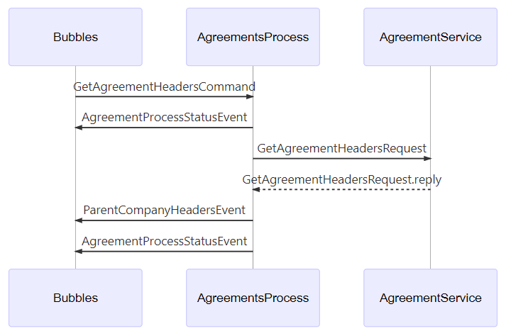

# Bubbles
Bubbles is a library to make testing message based systems much easier. It allows a test to be defined declaratively by defining the expected message flows. Bubbles will then start the execution. The message flow can then be validated that the actual messages sent on the bus match the definition. It also provides a mocking ability to override some messages, which can be used to inject the results of service call or to inject error conditions.

* [Structure](#Structure) 
* [Patterns](#Patterns)
* [API](#API)

## Structure
The structure of a Bubbles test consists of two parts:
* Bubble Flow
* Bubble definitions

### Bubble Flow
The Bubble Flow describes the order of the messages that you'd expect to see on the bus when initiated by the first message. Each of these definitions is called a `bubble` and is given an arbitrary name which is wrapped around `(name)` brackets.

As an example the flow for sending a message `A`, which then results in a message `B` being sent would look like the following:

```
(!A)(B)
```

As messaging has various ways to send and reply to a message. Bubbles has symbols which describe how a bubble is being sent or received. The symbols are prefixed to the bubble name. Below are the symbols used to describe the message intent:

#### Bubble symbols
| symbol |              description              |       method       |            example            |
| -      | -                                     | -                  | -                             |
| none   | message will be sent                  | sendAsync          | (submit-order)                |
| *      | message was/is published              | publishAsync       | (*order-complete)             |
| >      | message was/is sent expecting a reply | sendWithReplyAsync | (>api-request)                |
| @      | indicates a reply                     | replyAsync         | (>api-request)(@api-response) |

#### Mocking
One of the most powerful features of Bubbles is the ability to intercept any message and replace it with one defined by the test. This makes it easy to mock out an API request or to simulate error conditions. There are three different types of mocking, each with a slightly different syntax:

* Message Injection: simply adds the message to bus using the syntax:
(!message)
* Message Substitute: Modify a message before allowing it to hit the bus. This is a way to selectively override messages of a handler that is being executed using the syntax:
(!:message)
* Message Override: the most powerful option prevents a message from being sent to the bus. Instead Bubbles acts as the handler, and sends out the mocked message responses as if the original handler had. This option supports sending out multiple messages, which can be of any of the supported types. The syntax is:
(!message:response:response:response)

The meaning of the symbols are:.

| symbol | description                                                     |
| -      | -                                                               |
| !      | message will be supplied by test ie injected/mocked             |
| :      | indicates mocked response                                       |
| -      | a 1 time period (default 10ms) delay before sending the message |

### Bubble definition
Each bubble must have a definition that matches the name used for the bubble. The definitions describe  the message that is expected to arrive on the bus or that will be sent by the Bubbles library. This definition is then used to validate the correctness of the Bubble flow.

The Bubble definition consists of a name and a type:

```
name: type
```

The name is the same one that was provided when defining the Bubble followed by a colon. The type is a valid JSON object that describes the message. The only hard requirement is that the message have a `type` defined, as this is the only mandatory field for a message. Here's the previous examples Bubble Flow and definitions:

```
(!A)(B)

A: {"type": "A"}
B: {"type": "B"}
```

> Note that the JSON must have the field names quoted, and values also need to be quoted if they are strings.

#### Bubble definition merging
For very simple messages, defining the JSON as part of the text is acceptable and even recommended. However, for larger more complex messages, defining the entire message would become unwieldy. As such its possible to define these message types in code and provide them as part of the API call when executing the test.

However, there are likely times when its desirable to make minor modifications to a larger message or to highlight specific parts of that message. Bubbles allows this via definition merging. If a message type has been provided via code and has also been defined via the Bubble definition. The two will be merged with the Bubble definition taking priority. See the API documentation for more details and examples. 

#### Replies
When using a request-response pattern, the value returned from the `.sendWithReplyAsync` is not a an `IMessage<T>` its just `T`. As such when defining the Bubble definition you only supply the payload and not its type.

```
(!>A)(@B)

A: {"type": "A"}
B: {"response"}
```

#### Errors
Errors that are produced as a result of an unhandled error of that have been sent using the ABus using the `Bus.Error` type can be a little complex to define. To simplify this, Bubbles provides a special type definition to describe errors.

```
{"error":"an error message here"}
```

This type can be used instead of a standard message type to describe that an error message will be part of the flow. This example expands the previous example to define that after sending the message `B` and error is published.

```
(!A)(B)(*X)

A: {"type": "A"}
B: {"type": "B"}
X: {"error": "an error occurred" }
```

### Validation
The primary goal of defining a Bubble flow and their definitions is to validate that the actual flow of messages matches the definition. The way Bubbles does this is by capturing each message as its sent to the bus, then comparing that message with the expected Bubble in the Bubble flow. If they don't match then an exception is thrown with details of the expected and actual message.

Each Bubble definition is used to validate if the actual message matches what is expected. However the actual message could have additional data added via ABus tasks (aka middleware), or some fields may by design always be different. This means a direct comparison might make it impossible to ever get a match.

Bubbles solves this issue by only using the expected messages structure for comparing against the actual. This means any addition fields added to `metaData` for example would be ignored, unless they were explicitly added to the expected message type definition. If you have fields such as a timestamp that would always be different then by not specifying it as part of the expected message it would not impact the validation. The following example demonstrates this:

definition
```
order-received: {"type": "order-received", "orderId": "O-123456"}
```

actual
```
{"type": "order-received", "orderId": "O-123456", receivedAt: 1548452819}
```

In this example the validation would pass as the property `receivedAt` was not included in the Bubble definition.


## Patterns
To make understanding how to use Bubble effectively, this section describes some of the most common messaging patterns and how you would use Bubbles to test them.

### request response
The request response pattern is where the caller uses the `.requestWithReply` method and `awaits` the response. This is most commonly used when you need the response before continuing the next piece of logic. While this could be achieved by adding an additional `handler`, this can make the logic more difficult to follow.

handler
```ts
bus.subscribe("request", (message: IMessage<any>, context: IMessageHandlerContext) => {
    context.replyAsync("response");
});
```

caller
```ts
const reply = bus.sendWithReplyAsync({type: "request"});
```

#### using bubbles
This pattern can be tested using bubbles in two ways, either to validate the actual message flow as is or to override/mock out the response and supply a different one.

__Validate flow__
```ts
(!>request)(@response)

request: {"type": "request"}
response: {"real response"}
```
__Override response__
```ts
(!>request:@response)

request: {"type": "request"}
response: {"mocked response"}
```

__Override response with a 3 period delay__
```ts
(!>request:---@response)

request: {"type": "request"}
response: {"mocked response"}
```

### inject a message
This will send the message to the bus and allow the message to be handled by any subscribers. This pattern maybe useful to simulate how the system operates when receiving multiple input messages.

__send message to the bus after the previous-message is received__
(previous-message)(!request)

__wait 3 time periods before sending the request__
(!---request)

### substitute a message
With this pattern you want to replace a message with a different version of that message. The handler will then receive the new version of the message, rather than the original one sent. This pattern maybe useful when overriding select messages from a handler. The message types of the original and substitute must match for this to work.

(!:*response)

### override a message
With this pattern you want to override a message. This will prevent the original handler from receiving the message. As such its now the responsibility of the test to supply any message responses. This pattern is useful when a handler doesn't use a request-response pattern but sends data via an event (`.publishAsync`). 

(!request:*response)

### validate error conditions
A well tests API includes both the happy as well as the unhappy paths. Its important to validate that the API is validating input and returns appropriate messages when errors occur. Take the following example which is validating a handler verifies its input and produces the correct error.

custom error
```
(!get-customer)(*get-customer-response)

get-customer: {"type":"get-customer", "id":"XXXX"}
get-customer-response: {"type":"customer-invalid-format", "message": "Customer ID XXXX is not the correct format"}
```

generic thrown error
```
(!get-customer)(*get-customer-response)

get-customer: {"type":"get-customer", "id":"XXXX"}
get-customer-response: {"error": "Customer ID XXXX is not the correct format"}
```

### simulate errors
One of the powerful features of Bubbles is the ability to simulate conditions that would be difficult to do via traditional mocking. One of the most common scenarios is validating how code responds to different error conditions. In this example assume we have a process that's calling an API and we need to validate various error conditions the API could produce.

__Bubble Flow - Happy Path__
```
(!get-customer)(>api-get-customer)(@api-get-customer-response)(*get-customer-response)
```

We can modify this flow to override the api-calls and return an error condition instead.

__Bubble Flow - Not Found Path__
```
(!get-customer)(!>api-get-customer:@api-get-customer-response)(*get-customer-response)
```

Here we're overriding the message `api-get-customer` and supplying our own version which has the error call. The full Bubble Flow definition would be:

```
(!get-customer)(!>api-get-customer:@api-get-customer-response)(*get-customer-response)

get-customer: {"type":"get-customer", "id":"123"}
get-customer-response: {"type":"customer-not-found", "message": "Unable to locate customer ID: 123"}
api-get-customer: {"type":"api-get-customer", "id":"123"}
api-get-customer-response: {"error":"Invalid customer ID: 123"}
```

In this example we're interested in validating that the `get-customer-response` Bubble actually publishes the `customer-not-found` message, thereby validating the handler is processing the api errors correctly.

## API
The Bubbles API splits the test execution into two parts:
1. Execute the flow and record the result
1. Validate the result

The following examples assume that you have your handlers setup ready to receive any messages. For more information on how to register your handlers refer to the ABus documentation. The examples assume the following reasonably complex Bubble Definition:

```ts
const definition = 
    `
    (!request-headers)(*status-executing)(>api-request)(@api-response)(*request-headers-event)(*status-complete)
        
    request-headers: {"type":"GetAgreementHeadersCommand", "payload": {"tpid": "12345"}}
    api-request: {"type":"GetAgreementHeadersRequest", "payload": {"tpid": "12345"}}
    api-response: {"tpid": "12345", "agreementHeaders": [{"id":"1"},{"id":"2"}]}
    request-headers-event: {"type":"ParentCompanyHeadersEvent", "payload": {"tpid": "12345", "agreementHeaders": [{"id":"1"},{"id":"2"}]}}
    status-executing: {"type":"AgreementProcessStatusEvent", "payload": {"operation": "GetAgreementHeadersCommand", "status": "EXECUTING"}}
    status-complete: {"type":"AgreementProcessStatusEvent", "payload": {"operation": "GetAgreementHeadersCommand", "status": "COMPLETE"}}
    `
```

#### __.executeAsync__
To execute a bubble definition defined above, you call the `.executeAync` function passing in the definition. This initiate the message flow by sending the first message to the bus, which will kick off the message flow. As message are being send to the bus, bubbles will capture them for later comparison.

```ts
await bubbles.executeAsync(definition);
```

Its important to `await` the method call to ensure the execution is complete before continuing. Once complete its possible to run various validations or visualizations if that's required.

#### __.validate__
The validate function compares the observed messages that were captured when executing the `.executeAsync` function. This will validate that the message flow exactly matches the definition, and where it doesn't will throw an error with detailed information about the mismatch.

```ts
bubbles.validate();
```

If the messages are simple, then this is all the code that's necessary to validate a message flow. Bubbles will automatically act as the subscriber if messages are sent by a handler that you've not registered. This helps prevent unwanted side affects, and to isolate the handler under test.

To demonstrate what would happen if the definition didn't match we'll change the previous flow by removing the `(*status-executing)` bubble, so that we're missing one of the expected messages.

```ts
const definition = 
    `
    (!request-headers)(>api-request)(@api-response)(*request-headers-event)(*status-complete)
        
    request-headers: {"type":"GetAgreementHeadersCommand", "payload": {"tpid": "12345"}}
    api-request: {"type":"GetAgreementHeadersRequest", "payload": {"tpid": "12345"}}
    api-response: {"tpid": "12345", "agreementHeaders": [{"id":"1"},{"id":"2"}]}
    request-headers-event: {"type":"ParentCompanyHeadersEvent", "payload": {"tpid": "12345", "agreementHeaders": [{"id":"1"},{"id":"2"}]}}
    status-complete: {"type":"AgreementProcessStatusEvent", "payload": {"operation": "GetAgreementHeadersCommand", "status": "COMPLETE"}}
    `
```
Running this now would produce the following error:

```
bubble: api-request, message index: 1                                
                                                                     
+ expected - actual                                                  
                                                                     
{                                                                    
-     "type": "AgreementProcessStatusEvent",                         
+     "type": "GetAgreementHeadersRequest",                          
      "payload": {                                                         
-          "operation": "GetAgreementHeadersCommand",                
-          "status": "EXECUTING"                                     
-     },                                                             
-     "metaData": {                                                  
-          "intent": "publish",                                      
-          "messageId": "82ac60ca-42d6-4b87-9c93-526a3c7d1859",      
-          "conversationId": "7d3959ec-bbfa-48a7-b316-c18e516cf99a", 
-          "correlationId": "ae0677bb-3d24-4cae-b248-445a03646d3d",  
-          "receivedBy": "Bubbles"                                   
+          "tpid": "12345"                                           
}                                                                    
}                                                                    
```
Here its clearly indicating that the `AgreementProcessStatusEvent` should have arrived as the second message (`index 1`). However, instead the `GetAgreementHeadersRequest` message was received. This would let us know that there's either a bug in the code or our definition.

#### __observedMessages__
Returns a collection of `IMessage<T>` objects that were observed during execution. This can be used to perform various additional validations if required or to understand the actual message flow better.

#### __observedMessageOfType__
A shortcut way to access a particular message type from the observed message flow. It will return the first occurrence of the message type passed. If not found will throw an error.

```ts
const message = bubbles.observedMessageOfType("response");
```
This is particuarly useful to do additional validation of a particular message.

#### __enableTracing__
If you're experiencing issues with running Bubbles, you may want to enable the tracing feature. This feature will print out to the console details of how the bubble definitions are being interpreted. As an example you may think that a message should be getting handled or injected. This output will show if that's happening. This is a more advanced feature and not one that's expected to be used often.

```ts
bubbles.enableTracing();
await bubbles.executeAsync(...);
```

_result_
```
BUBBLES: injected: request-headers
BUBBLES: Received GetAgreementHeadersCommand: 11ms
BUBBLES: Received AgreementProcessStatusEvent: 20ms
BUBBLES: handled: status-executing
BUBBLES: Received GetAgreementHeadersRequest: 22ms
BUBBLES: Received GetAgreementHeadersRequest.reply: 26ms
BUBBLES: Received ParentCompanyHeadersEvent: 33ms
BUBBLES: handled: request-headers-event
BUBBLES: Received AgreementProcessStatusEvent: 36ms
BUBBLES: handled: status-complete
```

### Visualizations
Bubbles takes advantage of the message tracing that `Abus` supports and allows the auto-generation of several visualizations that can make it easier to understand the systems flow.

Here are the diagrams that can currently be produced using the previous example as input:

__Simple Ascii Tree__

_code_
```ts
bubbles.visualizations.printAsciiTree();
```

_result_
```
start
└╴ GetAgreementHeadersCommand (0ms)
   ├╴ AgreementProcessStatusEvent
   ├╴ GetAgreementHeadersRequest (0ms)
   │  └╴ GetAgreementHeadersRequest.reply (0ms)
   ├╴ ParentCompanyHeadersEvent
   └╴ AgreementProcessStatusEvent
```

__Process Diagram__

_code_
```ts
bubbles.visualizations.toProcessDiagram();
```

_result_
```
graph TD

AgreementsProcess
Bubbles
AgreementService
start --> |GetAgreementHeadersCommand| AgreementsProcess
AgreementsProcess --> |AgreementProcessStatusEvent| Bubbles
AgreementsProcess --> |GetAgreementHeadersRequest| AgreementService
AgreementService -.-> |GetAgreementHeadersRequest.reply| AgreementsProcess
AgreementsProcess --> |ParentCompanyHeadersEvent| Bubbles
AgreementsProcess --> |AgreementProcessStatusEvent| Bubbles
```

_mermaid render_


__Sequence Diagram__

_code_
```ts
bubbles.visualizations.toSequenceDiagram();
```
_result_
```
sequenceDiagram

participant Bubbles
participant AgreementsProcess
participant AgreementService
Bubbles->>AgreementsProcess:GetAgreementHeadersCommand
AgreementsProcess->>Bubbles:AgreementProcessStatusEvent
AgreementsProcess->>AgreementService:GetAgreementHeadersRequest
AgreementService-->>AgreementsProcess:GetAgreementHeadersRequest.reply
AgreementsProcess->>Bubbles:ParentCompanyHeadersEvent
AgreementsProcess->>Bubbles:AgreementProcessStatusEvent
```
_mermaid render_



> The mermaid diagrams can be rendered by using the text definition at the [mermaid live editor](https://mermaidjs.github.io/mermaid-live-editor/#)